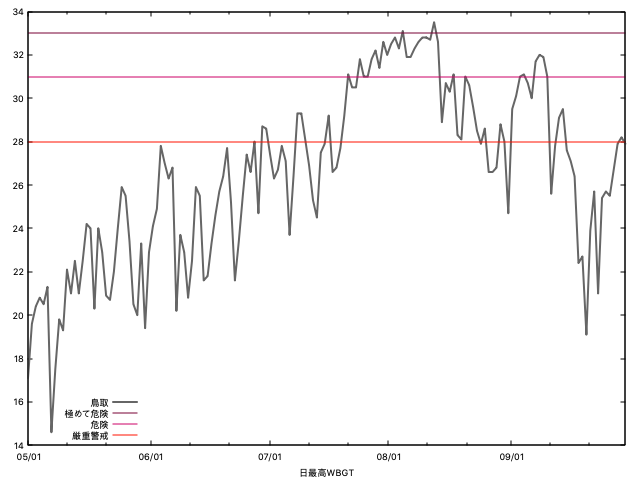
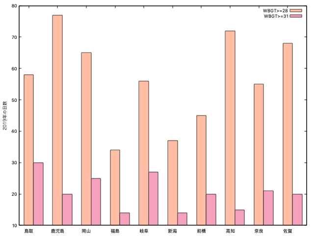

# 2019 年の WBGT

## データ取得
[環境省熱中症予防情報サイト](https://www.wbgt.env.go.jp/)からダウンロード
```bash
cd csv
bash download.sh
```

## 日最高WBGTの時系列

```bash
python daily_maximum.py
gnuplot draw_daily.plt
```



## 上位10地点のWBGT超過日数

```bash
python stat.py
gnuplot draw_stat.plt
```


